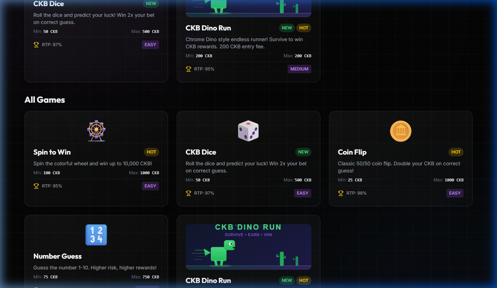
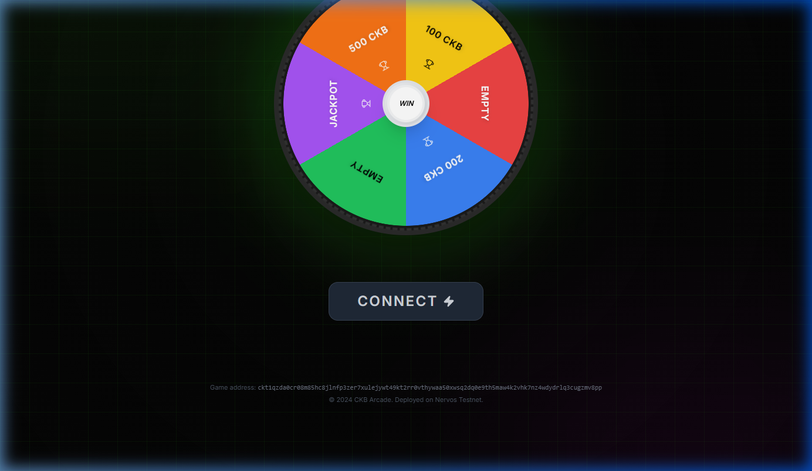
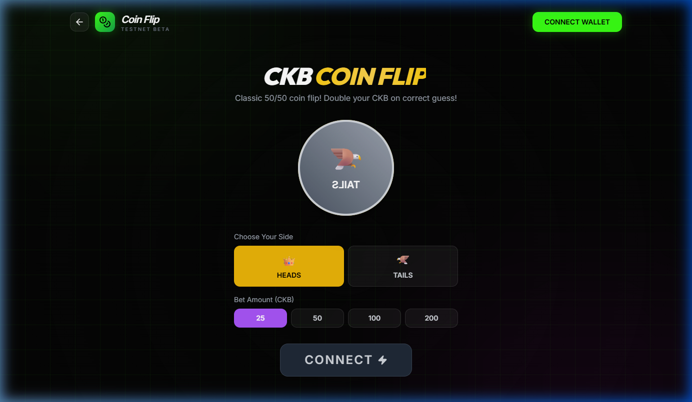
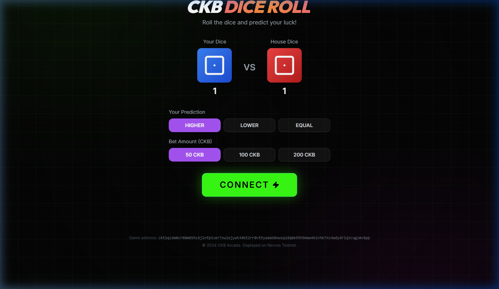
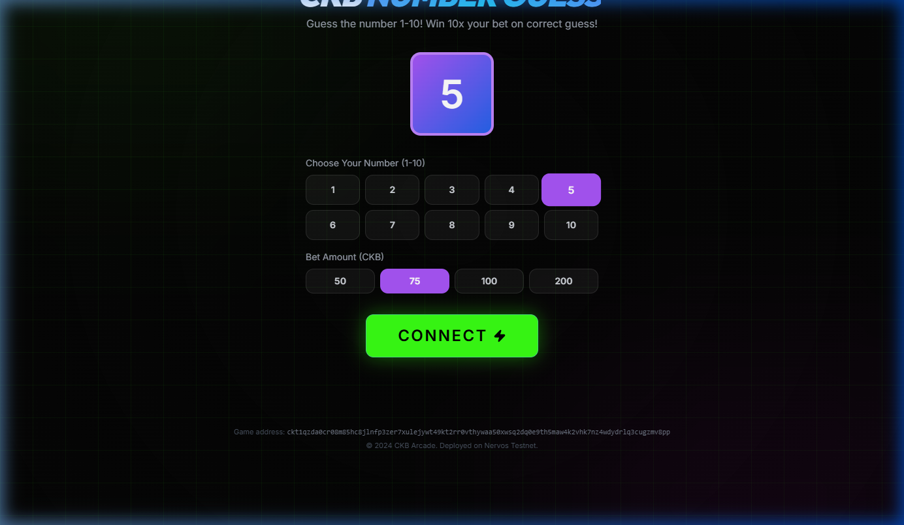
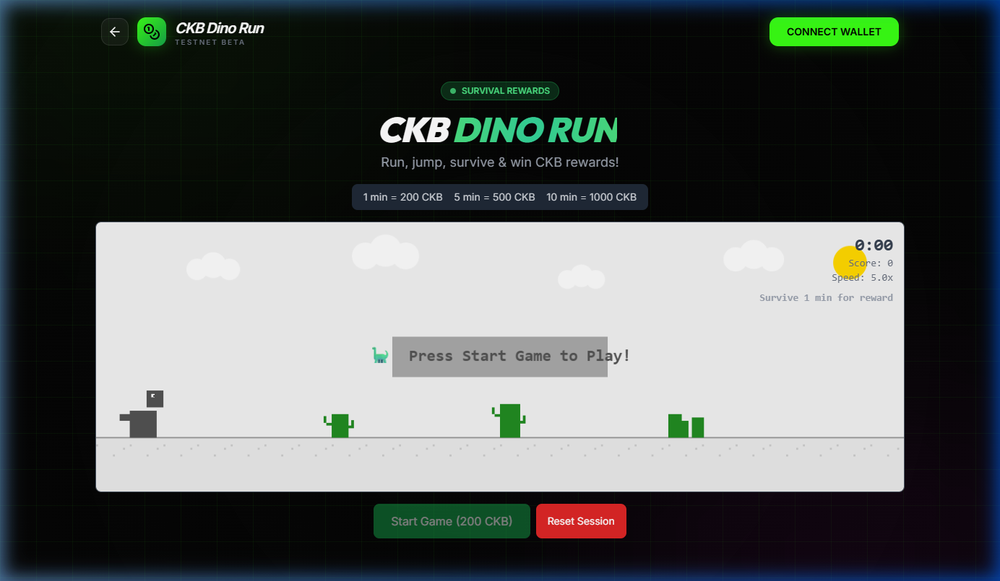

# Project Summary

CKB Arcade is a decentralized multi-game arcade platform built on the Nervos CKB blockchain (Testnet). Players connect their CKB wallet (JoyID, MetaMask, Spore, WalletConnect — auto-detected via CCC SDK), browse a game lobby, place bets using testnet CKB tokens, and receive automatic on-chain payouts from a house wallet. Game outcomes are determined using a two-party commit-reveal scheme: the player generates a secret and commits its hash, the backend commits its own hash, then both reveal — the XOR of both secrets produces a deterministic random seed that neither party could have predicted or manipulated alone. Players can independently verify every outcome by checking that `hash(houseSecret) === committedHouseHash` and `playerSecret XOR houseSecret === combinedRandom`. The backend is the authority for outcome computation and payouts, but fairness is cryptographically verifiable by any participant. The platform includes five fully playable games: a multiplier-based spin wheel, dice roll with variable payouts, classic coin flip, number guessing, and a canvas-rendered Chrome Dino-style endless runner with tiered survival rewards.

# Tools Used

- **Frontend:** React 18, TypeScript, Vite 5, Tailwind CSS 3, Canvas API (for the endless runner), Web Audio API (for game sound effects)
- **Wallet Integration:** `@ckb-ccc/connector-react` — supports JoyID, MetaMask (via Omnilock), Spore, WalletConnect, UniPass
- **Backend:** Node.js, Express, `@ckb-ccc/core` for CKB transaction building/signing, `crypto` module for commit-reveal (SHA-256, HMAC)
- **Blockchain:** Nervos CKB Testnet, secp256k1-blake160 lock scripts, UTXO cell model for bet/payout transactions
- **Deployment:** Vercel (frontend), Node.js server with Vercel serverless functions (backend)
- **PWA:** `vite-plugin-pwa` + `workbox-window` for installable progressive web app support

# Current Features

- Arcade lobby with game cards showing min/max bets, RTP, difficulty, and category filtering (All, Luck, Classic, Skill).
- **Spin to Win** — multiplier-based wheel (1.5x, 2x, 3x, 50x JACKPOT) with configurable bet amounts (100–1,000 CKB), ~94% RTP, animated CSS wheel with pointer ticker.
- **CKB Dice** — player vs house dice roll with three bet types: Higher (2.3x), Lower (2.3x), Equal (5.5x), ~96% RTP, animated dice with rolling sound effects.
- **Coin Flip** — classic 50/50 with 3D CSS coin rotation animation, 2x payout, 100% RTP, bet range 100–1,000 CKB.
- **Number Guess** — pick 1–10 for a 10x payout, 100% RTP, animated random number cascade.
- **CKB Dino Run** — full canvas-rendered endless runner with obstacle generation, lane system, collision detection, FPS monitoring, object pooling, and tiered survival rewards (1 min = 100 CKB, 5 min = 500 CKB, 10 min = 1,000 CKB).
- Provably fair commit-reveal randomness for all luck-based games with `ProvablyFairBadge` UI component showing full cryptographic proof.
- On-chain CKB betting: player sends bet transaction to house address, house sends payout transaction on win.
- Fee-bump retry logic (up to 5 attempts with RBF handling) for reliable CKB payout transactions.
- Server-side survival reward verification with anti-cheat bounds checking (1–3,600 seconds).
- Anti-bot protection: daily session limits (5 paid sessions per wallet per day) for the endless runner.
- Duplicate claim prevention via session ID tracking.
- Demo mode warning banner when backend is disconnected, alerting users to insecure local randomness.
- PWA support — installable as a native-feeling app.
- Responsive design with mobile-friendly layouts.
- Transaction explorer links (Nervos Pudge explorer) for all bet and payout transactions.

# Planned Features

- **Server-authoritative game sessions** — merge payout into the reveal phase so wins are automatically paid without a separate client-initiated payout call. This eliminates the ability for clients to claim arbitrary payouts.
- **On-chain bet verification** — before accepting a commit, verify the bet transaction exists on CKB and was sent to the house address with the correct amount.
- **Session-based authentication** — replace the static API key with per-session tokens so no master key is embedded in the frontend bundle.
- **Database persistence** — migrate from in-memory Maps to SQLite/Redis so game stats, player history, and anti-cheat tracking survive server restarts.
- **Rate limiting** — add `express-rate-limit` on all sensitive endpoints (`/api/payout`, `/api/commit`, `/api/reveal`).
- **Backend TypeScript migration** — convert the 780-line `index.js` to modular TypeScript with proper types.
- **On-chain game logic via CKB lock scripts** — custom lock scripts that enforce bet validation and outcome verification directly on-chain, removing trust in the backend entirely.
- **On-chain leaderboard** — store top scores in CKB cells (evaluating storage economics for cell capacity costs).
- **Multi-sig house wallet** — replace single private key with multi-sig for treasury safety.
- **Server-side survival session timing** — track endless runner session start time on the server to prevent clients from claiming rewards without playing.
- **New games** — Blackjack, Slots, Lottery (all compatible with the commit-reveal scheme).
- **Game history / audit log** — a UI for players to verify any past game outcome using the stored cryptographic proofs.
- **Mainnet deployment** once security hardening is complete.

# Deployed On

- **Testnet:** Yes. Frontend deployed on Vercel, backend deployed as Vercel serverless function. All game transactions use CKB Testnet tokens. House wallet is a secp256k1-blake160 address funded via the Nervos faucet.
- **Mainnet:** Not yet. Infrastructure and environment configuration are prepared but blocked on completing the security hardening (server-authoritative sessions, on-chain bet verification).

# Link to Repository

https://github.com/GxNaitik/ckb-learning-track/tree/main/ckb_arcade

# Link to Hosted Version

https://ckb-arcade.vercel.app

# Screenshots

<!-- Upload these images when creating the issue on GitHub (drag & drop into the editor) -->

# Request for Feedback

## Review

- Is the two-party commit-reveal scheme (SHA-256 hash commitment + XOR combination) a sound approach for provably fair randomness on CKB, or should I look into VRF or on-chain randomness sources? The current scheme requires both parties to participate honestly — if the player never reveals, the session expires (5 min timeout). Is there a better pattern?

- The current architecture has the backend compute game outcomes and trigger payouts separately. I'm planning to merge these into a single atomic flow where the `/api/reveal` endpoint both computes the outcome AND sends the payout transaction. Does this server-authoritative model sound correct, or should outcome computation move fully on-chain via CKB scripts?

- Each game currently builds its own CKB transaction for the bet (~80 lines of duplicated transaction building code across 4 games). I've been considering extracting this into a shared utility. Is there a recommended pattern in the CKB ecosystem for standardized betting transactions?

- The endless runner uses a canvas-based game loop with FPS monitoring, object pooling, and a lane system. Survival time is currently reported by the client. I plan to add server-side session timing. Are there other anti-cheat patterns used in blockchain gaming that would be relevant here?

## Guidance

- **On-chain game logic:** I want to move game rules into CKB lock scripts so outcomes can be verified on-chain without trusting the backend. What's the recommended approach for encoding commit-reveal logic in a CKB script? Should the bet cell's lock script enforce the reveal phase, or should a separate type script handle the game logic?

- **Cell capacity economics:** Each bet creates a cell, and each payout creates a cell. With many players, this could lead to a lot of live cells. What are the best practices for cell management in high-frequency dApps — should I consolidate cells periodically? Is there a standard pattern for recycling bet cells after payout?

- **House wallet safety:** Currently the house wallet is a single secp256k1 private key. For mainnet, I want to use multi-sig. What's the recommended multi-sig pattern on CKB? Would a 2-of-3 Omnilock configuration work, or is there a gaming-specific treasury pattern?

- **Storage costs for leaderboards:** I want to store top-10 leaderboard data on-chain per game. Given CKB's 1 CKB = 1 byte storage model, storing a leaderboard entry (address + score + timestamp ≈ 60 bytes) would cost ~60 CKB per entry. Is this economically viable, or should leaderboard data stay off-chain with periodic on-chain anchoring (Merkle root)?

- **Sponsoring new users:** Players need CKB to place bets, but new users won't have any. Is there a standard pattern for sponsoring cell capacity on CKB so first-time users can play without first visiting the faucet? Could the house wallet cover transaction fees via a meta-transaction pattern?

## Problems

- The commit-reveal flow currently has a race condition: the player's bet transaction is sent to the chain, and then the commit phase starts. If the commit or reveal fails (network error, timeout), the player has already lost their bet with no game played. I need to either: (a) verify the bet on-chain before starting the commit, or (b) implement a refund mechanism for failed sessions. What's the better approach?

- CKB transaction confirmation times can vary. The payout is sent immediately after the reveal, but the player's bet transaction might not be confirmed yet. This means the house is paying out before confirming it received the bet. I'm planning to add on-chain bet verification before payout — should I wait for 1 confirmation, or is checking the mempool sufficient on testnet?

- The house wallet can run into RBF (Replace-By-Fee) issues when multiple payouts are queued simultaneously. I've implemented a fee-bump retry loop (up to 5 attempts with 1.5x fee escalation), but under high load this could still fail. Is there a better pattern for batching CKB payouts?

- In-memory session storage means all anti-cheat protections (daily limits, duplicate claim prevention, session tracking) reset on every server restart or redeployment. This is critical for the endless runner where a player could exploit restarts to claim unlimited rewards. Moving to SQLite is planned, but is Redis a better fit for session-oriented data on CKB dApps?

- The frontend currently falls back to `Math.random()` for game outcomes when the backend is disconnected (demo mode). While I've added a warning banner, some users might not notice it. Should demo mode be removed entirely, or is there value in keeping it for offline/development use?

- Not all CKB wallets handle the signing flow consistently via CCC. JoyID sometimes takes 5-10 seconds to respond to `sendTransaction`, and MetaMask via Omnilock occasionally returns opaque errors. Is there a recommended error handling pattern for multi-wallet CKB dApps?
